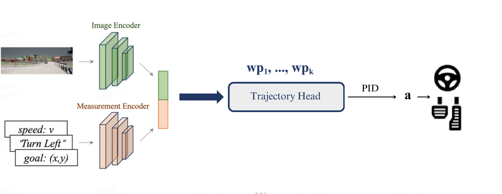

# dinoag - Trajectory Prediction for End-to-end Autonomous Driving

dinoag is a simple soluttion for trajectory prediction for end-to-end autonomous driving.  


## Pipeline



## Demo


[](https://raw.githubusercontent.com/louardibrahim/dinoag/blob/master/dinoag_carla.mp4)

<video src="dinoag_carla.mp4" controls="controls" style="max-width: 100%; height: auto;"></video>

## Setup
Download and setup CARLA 0.9.10.1
```
mkdir carla
cd carla
wget https://carla-releases.s3.eu-west-3.amazonaws.com/Linux/CARLA_0.9.10.1.tar.gz
wget https://carla-releases.s3.eu-west-3.amazonaws.com/Linux/AdditionalMaps_0.9.10.1.tar.gz
tar -xf CARLA_0.9.10.1.tar.gz
tar -xf AdditionalMaps_0.9.10.1.tar.gz
rm CARLA_0.9.10.1.tar.gz
rm AdditionalMaps_0.9.10.1.tar.gz
cd ..
```

Clone this repo and build the environment

```
git clone https://github.com/louardibrahim/dinoag.git
cd dinoag
conda env create -f environment.yml --name dinoag
conda activate dinoag
```

```
export PYTHONPATH=$PYTHONPATH:PATH_TO_dinoag
```

## Training
First, set the dataset path in ``dinoag/config.py``.
Training:
```
python dinoag/train.py --gpus NUM_OF_GPUS
```

## Data Generation
First, launch the carla server,
```
cd CARLA_ROOT
./CarlaUE4.sh --world-port=2000 -opengl
```
Set the carla path, routes file, scenario file, and data path for data generation in ``leaderboard/scripts/data_collection.sh``.

Start data collection

```
sh leaderboard/scripts/data_collection.sh
```
After the data collecting process, run `tools/filter_data.py` and `tools/gen_data.py` to filter out invalid data and pack the data for training.

## Evaluation
First, launch the carla server,
```
cd CARLA_ROOT
./CarlaUE4.sh --world-port=2000 -opengl
```
Set the carla path, routes file, scenario file, model ckpt, and data path for evaluation in ``leaderboard/scripts/run_evaluation.sh``.

Start the evaluation

```
sh leaderboard/scripts/run_evaluation.sh
```


## Acknowledgements

this code is based on several repositories:
- [Transfuser](https://github.com/autonomousvision/transfuser)
- [Roach](https://github.com/zhejz/carla-roach)
- [CARLA Leaderboard](https://github.com/carla-simulator/leaderboard)
- [Scenario Runner](https://github.com/carla-simulator/scenario_runner)

